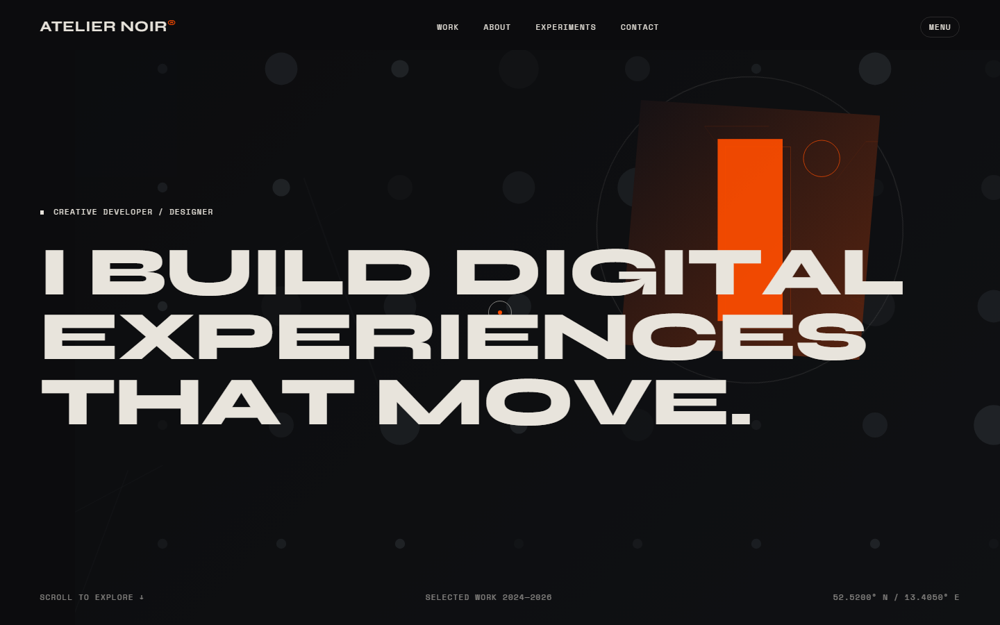
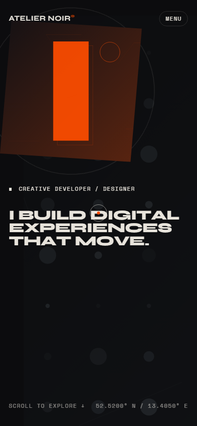
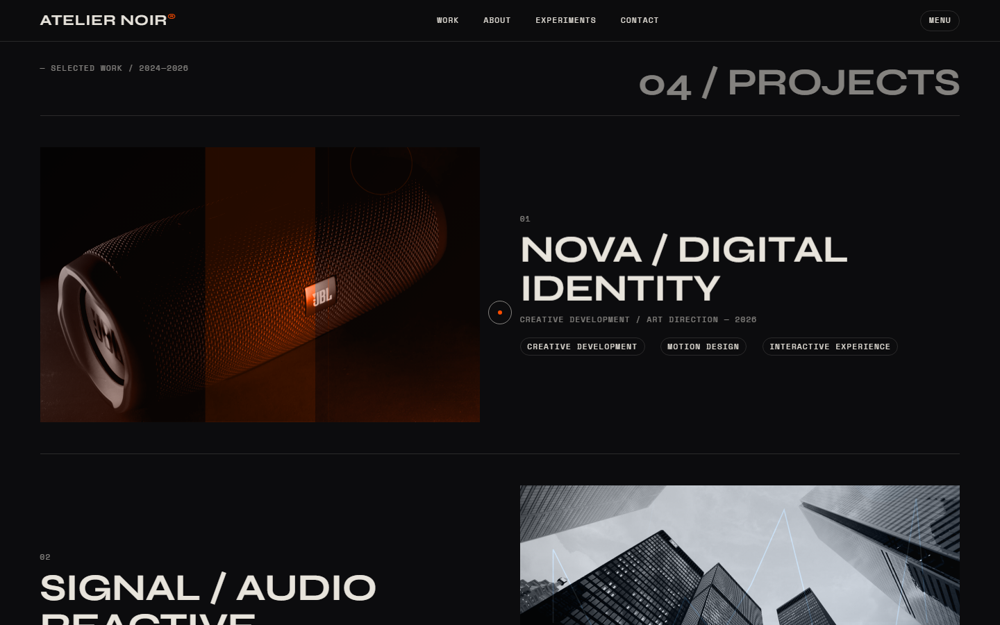
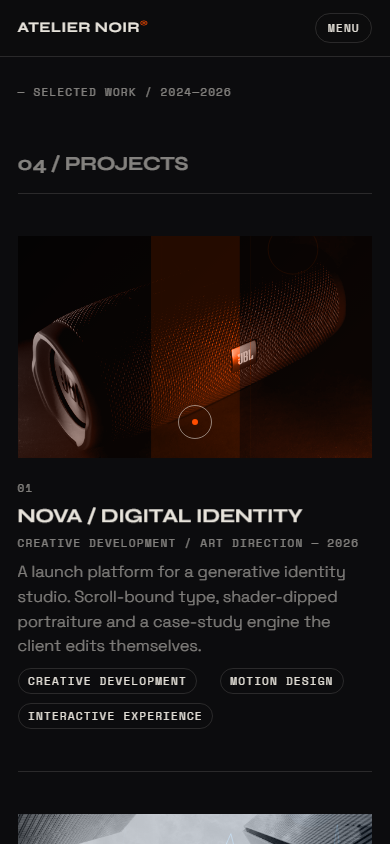
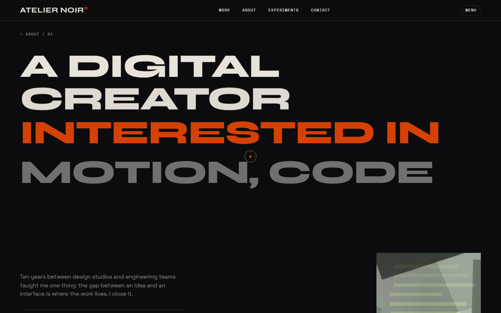
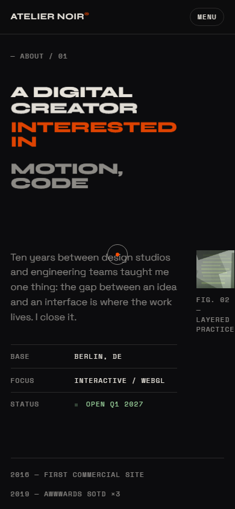
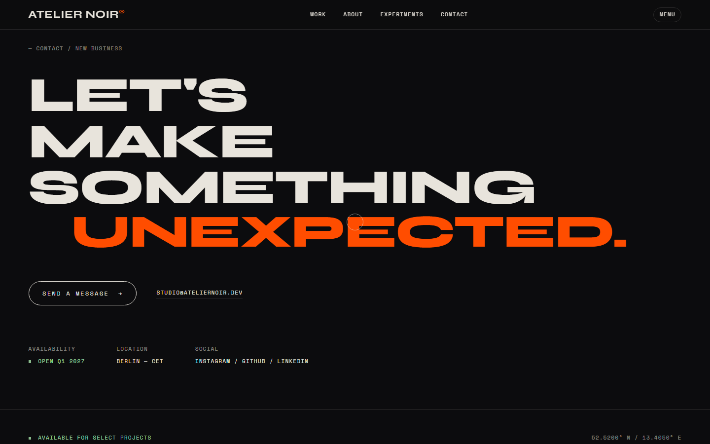
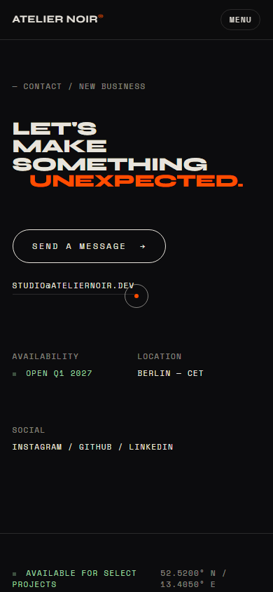

<div align="center">

# ATELIER NOIR

**Creative Developer & Digital Art Director — Interactive Experiences, Motion & Experimental Interfaces**

[](https://react.dev/)
[](https://www.typescriptlang.org/)
[](https://vitejs.dev/)
[](https://gsap.com/)
[](#license)

[Live Demo](https://atelirnoir.dev) · [View Source](https://github.com/LouweS/Creative-Developer-Portfolio)

</div>

---

## Overview

Atelier Noir is a high-performance creative portfolio built for a Berlin-based digital art director. It combines editorial design, generative artwork, and fluid motion into a single-page experience that demonstrates technical craft through interaction rather than explanation.

**The problem it solves:** Standard portfolio templates flatten creative work into static image grids. Atelier Noir treats the portfolio itself as a creative artifact — scroll-driven storytelling, canvas experiments, and cursor-reactive typography let visitors *feel* the work instead of just viewing it.

---

## Features

- **Generative SVG artwork system** — Deterministic abstract compositions, infinitely scalable, zero network cost
- **Canvas-based experiments** — Three interactive micro-experiments (repellent field, signal drift, orbital type) lazily activated on scroll
- **Horizontal scroll storytelling** — Vertical scroll drives a horizontal process rail via `requestAnimationFrame`
- **Cursor-reactive typography** — Hero characters repel from the pointer with physics-based easing
- **Infinite gallery rail** — Cursor position modulates drift speed and direction; hover distorts tiles
- **Custom cursor** — Context-aware cursor with state labels (`OPEN`, `COPY`, `DRAG`, `RUN`)
- **Cinematic loader** — Real progress tracking from asset/font readiness, capped at ~1.4s
- **Performance monitor** — Dev-only FPS panel (`Shift+P`) with real rAF delta measurements
- **Reduced motion support** — All animations gracefully degrade when `prefers-reduced-motion` is active
- **Accessible** — Skip links, ARIA labels, semantic HTML, keyboard-navigable
- **Responsive** — Fluid typography and layout across desktop and mobile

---

## Screenshots

<div align="center">

| Desktop | Mobile |
|---------|--------|
|  |  |
|  |  |
|  |  |
|  |  |

</div>

---

## Tech Stack

| Category | Technology |
|----------|------------|
| **Framework** | React 18 |
| **Language** | TypeScript 5.5 |
| **Build** | Vite 5 |
| **Animation** | GSAP 3 + ScrollTrigger |
| **Scrolling** | Lenis |
| **Testing** | Vitest + Testing Library |
| **E2E Testing** | Playwright |
| **Typography** | Syne, Space Grotesk, Space Mono (Google Fonts) |

---

## Getting Started

### Prerequisites

- [Node.js](https://nodejs.org/) 18+ (LTS recommended)
- npm or yarn

### Installation

```bash
git clone https://github.com/LouweS/Creative-Developer-Portfolio.git
cd Creative-Developer-Portfolio
npm install
```

### Development

```bash
npm run dev
```

The dev server starts at `http://localhost:5173` with HMR.

### Build

```bash
npm run build
```

Outputs to `dist/` — ready for static hosting.

### Preview

```bash
npm run preview
```

---

## Usage

The site is a single-page experience. Key interactions:

| Action | Description |
|--------|-------------|
| **Scroll** | Drives all animations — horizontal process rail, section reveals, gallery drift |
| **Move cursor** | Hero letters repel, gallery speed changes, sculpture rotates |
| **Hover work rows** | Highlights project, shows tags and case study preview |
| **Click project** | Opens full case study overlay |
| **Hover gallery tile** | Distorts and scales the image |
| **Activate experiments** | Launches canvas micro-experiments (lazy, on-click) |
| **Shift+P** | Toggles FPS performance monitor (dev only) |
| **Skip link** | Tab to "Skip to content" for keyboard users |

---

## Project Structure

```
├── public/
│   └── img/              # Project images and assets
├── shots/                # Portfolio screenshots (desktop & mobile)
├── src/
│   ├── components/
│   │   ├── About.tsx     # About section with layered grid
│   │   ├── Artwork.tsx   # Generative SVG artwork system
│   │   ├── CaseStudy.tsx # Project detail overlay
│   │   ├── Contact.tsx   # Contact with email copy
│   │   ├── Cursor.tsx    # Custom context-aware cursor
│   │   ├── Experiments.tsx # Canvas micro-experiments
│   │   ├── Footer.tsx    # Site footer
│   │   ├── Gallery.tsx   # Infinite horizontal gallery rail
│   │   ├── Hero.tsx      # Hero with cursor-reactive type
│   │   ├── Loader.tsx    # Cinematic preloader
│   │   ├── Nav.tsx       # Navigation
│   │   ├── PerfPanel.tsx # Dev FPS monitor
│   │   ├── Process.tsx   # Horizontal scroll process section
│   │   └── Work.tsx      # Project showcase with case studies
│   ├── lib/
│   │   └── motion.ts     # Shared animation utilities (lerp, reveal hooks)
│   ├── App.tsx           # Root component, Lenis + GSAP setup
│   ├── main.tsx          # Entry point
│   └── styles.css        # Full stylesheet (ink/bone/signal palette)
├── tests/
│   ├── components.test.tsx
│   ├── motion.test.ts
│   ├── setup.ts
│   └── e2e/
│       └── experience.spec.ts
├── index.html
├── vite.config.ts
├── tsconfig.json
└── package.json
```

---

## Testing

### Unit Tests

```bash
npm test
```

Runs Vitest with jsdom environment and Testing Library.

### Watch Mode

```bash
npm run test:watch
```

### End-to-End Tests

```bash
npm run e2e
```

Runs Playwright tests against the built site.

---

## Configuration

No environment variables are required. All configuration lives in:

| File | Purpose |
|------|---------|
| `vite.config.ts` | Build targets, chunk splitting, test config |
| `tsconfig.json` | TypeScript strict mode, JSX settings |
| `playwright.config.ts` | E2E test configuration |

---

## Deployment

This is a static site. Deploy the `dist/` folder to any static host:

- [Vercel](https://vercel.com) — `npm run build` → auto-detected
- [Netlify](https://netlify.com) — Build command: `npm run build`, publish: `dist`
- [Cloudflare Pages](https://pages.cloudflare.com) — Framework preset: Vite
- [GitHub Pages](https://pages.github.com) — Use `dist/` as source

---

## Contributing

1. Fork the repository
2. Create a feature branch (`git checkout -b feature/my-feature`)
3. Commit changes (`git commit -m "Add my feature"`)
4. Push to branch (`git push origin feature/my-feature`)
5. Open a Pull Request

Please run `npm test` and `npm run build` before submitting.

---

## License

This project is licensed under the [MIT License](LICENSE).

---

<div align="center">

**ATELIER NOIR** · Berlin, DE · [studio@ateliernoir.dev](mailto:studio@ateliernoir.dev)

</div>

+ Thought: 155ms
Done. README.md has been created with:
Hero section with badges and links
Overview explaining the project's purpose
Features highlighting 12 key capabilities
Screenshots table comparing desktop and mobile
Tech stack table organized by category
Getting started with install, dev, build, and preview commands
Usage table describing all interactions
Project structure tree with component descriptions
Testing section covering unit and E2E
Configuration referencing existing config files
Deployment options for major static hosts
Contributing workflow
License section
